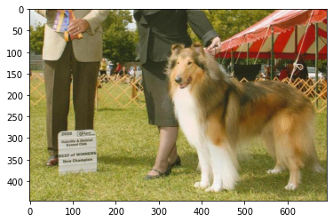

[//]: # (Image References)

[image1]: ./images/sample_dog_output.png "Sample Output"
[image2]: ./images/vgg16_model.png "VGG-16 Model Layers"
[image3]: ./images/vgg16_model_draw.png "VGG16 Model Figure"


## Project Overview

Welcome to the Convolutional Neural Networks (CNN) project in the AI Nanodegree! In this project, you will learn how to build a pipeline that can be used within a web or mobile app to process real-world, user-supplied images.  Given an image of a dog, your algorithm will identify an estimate of the canine’s breed.  If supplied an image of a human, the code will identify the resembling dog breed.  

![Sample Output][image1]

Along with exploring state-of-the-art CNN models for classification and localization, you will make important design decisions about the user experience for your app.  Our goal is that by completing this lab, you understand the challenges involved in piecing together a series of models designed to perform various tasks in a data processing pipeline.  Each model has its strengths and weaknesses, and engineering a real-world application often involves solving many problems without a perfect answer.  Your imperfect solution will nonetheless create a fun user experience!


## Project Instructions

### Instructions

1. Clone the repository and navigate to the downloaded folder.
	
	```	
		git clone https://github.com/udacity/deep-learning-v2-pytorch.git
		cd deep-learning-v2-pytorch/project-dog-classification
	```
	
__NOTE:__ if you are using the Udacity workspace, you *DO NOT* need to re-download the datasets in steps 2 and 3 - they can be found in the `/data` folder as noted within the workspace Jupyter notebook.

2. Download the [dog dataset](https://s3-us-west-1.amazonaws.com/udacity-aind/dog-project/dogImages.zip).  Unzip the folder and place it in the repo, at location `path/to/dog-project/dogImages`.  The `dogImages/` folder should contain 133 folders, each corresponding to a different dog breed.
3. Download the [human dataset](http://vis-www.cs.umass.edu/lfw/lfw.tgz).  Unzip the folder and place it in the repo, at location `path/to/dog-project/lfw`.  If you are using a Windows machine, you are encouraged to use [7zip](http://www.7-zip.org/) to extract the folder. 
4. Make sure you have already installed the necessary Python packages according to the README in the program repository.
5. Open a terminal window and navigate to the project folder. Open the notebook and follow the instructions.
	
	```
		jupyter notebook dog_app.ipynb
	```

__NOTE:__ While some code has already been implemented to get you started, you will need to implement additional functionality to successfully answer all of the questions included in the notebook. __Unless requested, do not modify code that has already been included.__

__NOTE:__ In the notebook, you will need to train CNNs in PyTorch.  If your CNN is taking too long to train, feel free to pursue one of the options under the section __Accelerating the Training Process__ below.


## (Optionally) Accelerating the Training Process 

If your code is taking too long to run, you will need to either reduce the complexity of your chosen CNN architecture or switch to running your code on a GPU.  If you'd like to use a GPU, you can spin up an instance of your own:

#### Amazon Web Services

You can use Amazon Web Services to launch an EC2 GPU instance. (This costs money, but enrolled students should see a coupon code in their student `resources`.)

## Evaluation

Your project will be reviewed by a Udacity reviewer against the CNN project rubric.  Review this rubric thoroughly and self-evaluate your project before submission.  All criteria found in the rubric must meet specifications for you to pass.


## Project Submission

Your submission should consist of the github link to your repository.  Your repository should contain:
- The `dog_app.ipynb` file with fully functional code, all code cells executed and displaying output, and all questions answered.
- An HTML or PDF export of the project notebook with the name `report.html` or `report.pdf`.

Please do __NOT__ include any of the project data sets provided in the `dogImages/` or `lfw/` folders.

### Ready to submit your project?

Click on the "Submit Project" button in the classroom and follow the instructions to submit!


# Convolutional Neural Networks

## Project: Write an Algorithm for a Dog Identification App 

---

In this notebook, some template code has already been provided for you, and you will need to implement additional functionality to successfully complete this project. You will not need to modify the included code beyond what is requested. Sections that begin with **'(IMPLEMENTATION)'** in the header indicate that the following block of code will require additional functionality which you must provide. Instructions will be provided for each section, and the specifics of the implementation are marked in the code block with a 'TODO' statement. Please be sure to read the instructions carefully! 

> **Note**: Once you have completed all of the code implementations, you need to finalize your work by exporting the Jupyter Notebook as an HTML document. Before exporting the notebook to html, all of the code cells need to have been run so that reviewers can see the final implementation and output. You can then export the notebook by using the menu above and navigating to **File -> Download as -> HTML (.html)**. Include the finished document along with this notebook as your submission.

In addition to implementing code, there will be questions that you must answer which relate to the project and your implementation. Each section where you will answer a question is preceded by a **'Question X'** header. Carefully read each question and provide thorough answers in the following text boxes that begin with **'Answer:'**. Your project submission will be evaluated based on your answers to each of the questions and the implementation you provide.

>**Note:** Code and Markdown cells can be executed using the **Shift + Enter** keyboard shortcut.  Markdown cells can be edited by double-clicking the cell to enter edit mode.

The rubric contains _optional_ "Stand Out Suggestions" for enhancing the project beyond the minimum requirements. If you decide to pursue the "Stand Out Suggestions", you should include the code in this Jupyter notebook.


---
### Why We're Here 

In this notebook, you will make the first steps towards developing an algorithm that could be used as part of a mobile or web app.  At the end of this project, your code will accept any user-supplied image as input.  If a dog is detected in the image, it will provide an estimate of the dog's breed.  If a human is detected, it will provide an estimate of the dog breed that is most resembling.  The image below displays potential sample output of your finished project (... but we expect that each student's algorithm will behave differently!). 


In this real-world setting, you will need to piece together a series of models to perform different tasks; for instance, the algorithm that detects humans in an image will be different from the CNN that infers dog breed.  There are many points of possible failure, and no perfect algorithm exists.  Your imperfect solution will nonetheless create a fun user experience!

### The Road Ahead

We break the notebook into separate steps.  Feel free to use the links below to navigate the notebook.

* [Step 0](#step0): Import Datasets
* [Step 1](#step1): Detect Humans
* [Step 2](#step2): Detect Dogs
* [Step 3](#step3): Create a CNN to Classify Dog Breeds (from Scratch)
* [Step 4](#step4): Create a CNN to Classify Dog Breeds (using Transfer Learning)
* [Step 5](#step5): Write your Algorithm
* [Step 6](#step6): Test Your Algorithm

---
<a id='step0'></a>
## Step 0: Import Datasets

Make sure that you've downloaded the required human and dog datasets:
* Download the [dog dataset](https://s3-us-west-1.amazonaws.com/udacity-aind/dog-project/dogImages.zip).  Unzip the folder and place it in this project's home directory, at the location `/dogImages`. 

* Download the [human dataset](https://s3-us-west-1.amazonaws.com/udacity-aind/dog-project/lfw.zip).  Unzip the folder and place it in the home directory, at location `/lfw`.  

*Note: If you are using a Windows machine, you are encouraged to use [7zip](http://www.7-zip.org/) to extract the folder.*

In the code cell below, we save the file paths for both the human (LFW) dataset and dog dataset in the numpy arrays `human_files` and `dog_files`.


```python
from collections import OrderedDict
```


```python
import numpy as np
from glob import glob

# load filenames for human and dog images
human_files = np.array(glob("data/lfw/*/*"))
dog_files = np.array(glob("data/dogImages/*/*/*"))

# print number of images in each dataset
print('There are %d total human images.' % len(human_files))
print('There are %d total dog images.' % len(dog_files))
```

    There are 13233 total human images.
    There are 8351 total dog images.
    

<a id='step1'></a>
## Step 1: Detect Humans

In this section, we use OpenCV's implementation of [Haar feature-based cascade classifiers](http://docs.opencv.org/trunk/d7/d8b/tutorial_py_face_detection.html) to detect human faces in images.  

OpenCV provides many pre-trained face detectors, stored as XML files on [github](https://github.com/opencv/opencv/tree/master/data/haarcascades).  We have downloaded one of these detectors and stored it in the `haarcascades` directory.  In the next code cell, we demonstrate how to use this detector to find human faces in a sample image.


```python
import cv2                
import matplotlib.pyplot as plt                        
%matplotlib inline   
```


```python
                        
# extract pre-trained face detector
face_cascade = cv2.CascadeClassifier('haarcascades/haarcascade_frontalface_alt.xml')

# load color (BGR) image
img = cv2.imread(human_files[0])
# convert BGR image to grayscale COLOR_BGR2GRAY
gray = cv2.cvtColor(img, cv2.COLOR_BGR2GRAY)

# find faces in image
faces = face_cascade.detectMultiScale(gray)

# print number of faces detected in the image
print('Number of faces detected:', len(faces))

# get bounding box for each detected face
for (x,y,w,h) in faces:
    # add bounding box to color image
    cv2.rectangle(img,(x,y),(x+w,y+h),(255,0,0),2)
    
# convert BGR image to RGB for plotting
cv_rgb = cv2.cvtColor(img, cv2.COLOR_BGR2RGB)

# display the image, along with bounding box
plt.imshow(cv_rgb)
plt.show()
```

    Number of faces detected: 1
    


Before using any of the face detectors, it is standard procedure to convert the images to grayscale.  The `detectMultiScale` function executes the classifier stored in `face_cascade` and takes the grayscale image as a parameter.  

In the above code, `faces` is a numpy array of detected faces, where each row corresponds to a detected face.  Each detected face is a 1D array with four entries that specifies the bounding box of the detected face.  The first two entries in the array (extracted in the above code as `x` and `y`) specify the horizontal and vertical positions of the top left corner of the bounding box.  The last two entries in the array (extracted here as `w` and `h`) specify the width and height of the box.

### Write a Human Face Detector

We can use this procedure to write a function that returns `True` if a human face is detected in an image and `False` otherwise.  This function, aptly named `face_detector`, takes a string-valued file path to an image as input and appears in the code block below.


```python
# returns "True" if face is detected in image stored at img_path
def face_detector(img_path):
    img = cv2.imread(img_path)
    gray = cv2.cvtColor(img, cv2.COLOR_BGR2GRAY)
    faces = face_cascade.detectMultiScale(gray)
    return len(faces) > 0
```


```python
# Alternate algorithm face detection method
def face_detector_2(img_path, scale=1.1, min_n=5, min_s=(30,30)):
    img = cv2.imread(img_path)
    gray = cv2.cvtColor(img, cv2.COLOR_BGR2GRAY)
    faces = face_cascade.detectMultiScale(
        gray, 
        scaleFactor=scale, 
        minNeighbors=min_n, 
        flags=cv2.CASCADE_SCALE_IMAGE,
        minSize=min_s
    )
    return len(faces) > 0
```

### (IMPLEMENTATION) Assess the Human Face Detector

__Question 1:__ Use the code cell below to test the performance of the `face_detector` function.  
- What percentage of the first 100 images in `human_files` have a detected human face?  
- What percentage of the first 100 images in `dog_files` have a detected human face? 

Ideally, we would like 100% of human images with a detected face and 0% of dog images with a detected face.  You will see that our algorithm falls short of this goal, but still gives acceptable performance.  We extract the file paths for the first 100 images from each of the datasets and store them in the numpy arrays `human_files_short` and `dog_files_short`.

__Answer:__ 
(You can print out your results and/or write your percentages in this cell)


```python
from tqdm import tqdm
test_count = 100
human_files_short = human_files[:test_count]
dog_files_short = dog_files[:test_count]

#-#-# Do NOT modify the code above this line. #-#-#
human_file_face_count, dog_file_face_count = 0, 0

for files in zip(human_files_short, dog_files_short):
    # Test face detection on human file i
    if face_detector(files[0]):
        human_file_face_count += 1
    
    if face_detector(files[1]):
        dog_file_face_count += 1
    
print(f'Human Faces in human files: {human_file_face_count}/{test_count} or {human_file_face_count/test_count*100}%')
print(f'Human Faces in dog files:   {dog_file_face_count}/{test_count} or {dog_file_face_count/test_count*100}%')

```

    Human Faces in human files: 96/100 or 96.0%
    Human Faces in dog files:   18/100 or 18.0%
    

We suggest the face detector from OpenCV as a potential way to detect human images in your algorithm, but you are free to explore other approaches, especially approaches that make use of deep learning :).  Please use the code cell below to design and test your own face detection algorithm.  If you decide to pursue this _optional_ task, report performance on `human_files_short` and `dog_files_short`.


```python
### (Optional) 
### TODO: Test performance of another face detection algorithm.
### Feel free to use as many code cells as needed.
human_file_face_count2, dog_file_face_count2 = 0, 0

for files in zip(human_files_short, dog_files_short):
    # Test face detection on human file i
    if face_detector_2(files[0], scale=1.1):
        human_file_face_count2 += 1
    
    if face_detector_2(files[1], scale=1.1):
        dog_file_face_count2 += 1
    
print(f'Human Faces in human files: {human_file_face_count2}/{test_count} or {human_file_face_count2/test_count*100}%')
print(f'Human Faces in dog files:   {dog_file_face_count2}/{test_count} or {dog_file_face_count2/test_count*100}%')

```

    Human Faces in human files: 95/100 or 95.0%
    Human Faces in dog files:   9/100 or 9.0%
    

### Optional Review

For this option portion, I used a similar algorithm but explored using the various parameters that `detectMultiScale` supports to see if we could get better results.  Although we saw better detection results while using the dog photos, we had a reduction in accuracy when finding human faces in human images.  The original algorithm is suffice for now.

---

---
<a id='step2'></a>
## Step 2: Detect Dogs

In this section, we use a [pre-trained model](http://pytorch.org/docs/master/torchvision/models.html) to detect dogs in images.  

### Obtain Pre-trained VGG-16 Model

The code cell below downloads the VGG-16 model, along with weights that have been trained on [ImageNet](http://www.image-net.org/), a very large, very popular dataset used for image classification and other vision tasks.  ImageNet contains over 10 million URLs, each linking to an image containing an object from one of [1000 categories](https://gist.github.com/yrevar/942d3a0ac09ec9e5eb3a).  


```python
import torch
import torchvision.models as models

# define VGG16 model
VGG16 = models.vgg16(pretrained=True)

# check if CUDA is available
use_cuda = torch.cuda.is_available()

# move model to GPU if CUDA is available
if use_cuda:
    VGG16 = VGG16.cuda()
```


```python
use_cuda
```


    True


Given an image, this pre-trained VGG-16 model returns a prediction (derived from the 1000 possible categories in ImageNet) for the object that is contained in the image.

### (IMPLEMENTATION) Making Predictions with a Pre-trained Model

In the next code cell, you will write a function that accepts a path to an image (such as `'dogImages/train/001.Affenpinscher/Affenpinscher_00001.jpg'`) as input and returns the index corresponding to the ImageNet class that is predicted by the pre-trained VGG-16 model.  The output should always be an integer between 0 and 999, inclusive.

Before writing the function, make sure that you take the time to learn  how to appropriately pre-process tensors for pre-trained models in the [PyTorch documentation](http://pytorch.org/docs/stable/torchvision/models.html).


```python
def imshow(image, ax=None, title=None):
    """Imshow for Tensor."""
    if ax is None:
        fig, ax = plt.subplots()

    # PyTorch tensors assume the color channel is the first dimension
    # but matplotlib assumes is the third dimension
    image = image.numpy().transpose((1, 2, 0))

    # Undo preprocessing
    mean = np.array([0.485, 0.456, 0.406])
    std = np.array([0.229, 0.224, 0.225])
    image = std * image + mean

    # Image needs to be clipped between 0 and 1 or it looks like noise when displayed
    image = np.clip(image, 0, 1)

    ax.imshow(image)

    return ax
```


```python
from PIL import Image
import torchvision.transforms as transforms
from torch.autograd import Variable

# Set PIL to be tolerant of image files that are truncated.
from PIL import ImageFile
ImageFile.LOAD_TRUNCATED_IMAGES = True
```


```python


def VGG16_predict(img_path, verbose=False):
    '''
    Use pre-trained VGG-16 model to obtain index corresponding to 
    predicted ImageNet class for image at specified path
    
    Args:
        img_path: path to an image
        
    Returns:
        Index corresponding to VGG-16 model's prediction
    '''
    
    ## TODO: Complete the function.
    ## Load and pre-process an image from the given img_path
    ## Return the *index* of the predicted class for that image
    VGG16.eval()
    
    t = transforms.Compose([
        transforms.Resize(224),
        transforms.ToTensor(),
        transforms.Normalize(mean=[0.485, 0.456, 0.406],
                                     std=[0.229, 0.224, 0.225]),
        
    ])
    
    img_orig = Image.open(img_path).convert('RGB')
    
    # Process image using the transform pipeline
    img = t(img_orig)   
    
    # Show images
    if verbose:
        fig = plt.figure()
        ax = fig.add_subplot(1, 2, 1)
        imgplot = plt.imshow(img_orig)
        ax.set_title('Original')
        ax = fig.add_subplot(1, 2, 2)
        imgplot = plt.imshow(img.numpy().transpose((1, 2, 0)))
        ax.set_title('Transformed')
    
    # Get Prediction
    img = Variable(img.unsqueeze(0)).to("cuda")
    
    output = VGG16(img)
    
    ps = torch.exp(output)
    top_p, top_class = ps.topk(1, dim=1)
    
    if verbose:
        print(f'Pred: {top_class}')
    
    return top_class.cpu().numpy()[0][0] # predicted class index
```


```python
file = 'data/dogImages/test/015.Basset_hound/Basset_hound_01034.jpg'
print(VGG16_predict(file, verbose=True))
```

    Clipping input data to the valid range for imshow with RGB data ([0..1] for floats or [0..255] for integers).
    

    Pred: tensor([[161]], device='cuda:0')
    161
    


### (IMPLEMENTATION) Write a Dog Detector

While looking at the [dictionary](https://gist.github.com/yrevar/942d3a0ac09ec9e5eb3a), you will notice that the categories corresponding to dogs appear in an uninterrupted sequence and correspond to dictionary keys 151-268, inclusive, to include all categories from `'Chihuahua'` to `'Mexican hairless'`.  Thus, in order to check to see if an image is predicted to contain a dog by the pre-trained VGG-16 model, we need only check if the pre-trained model predicts an index between 151 and 268 (inclusive).

Use these ideas to complete the `dog_detector` function below, which returns `True` if a dog is detected in an image (and `False` if not).


```python
### returns "True" if a dog is detected in the image stored at img_path
def dog_detector(img_path):
    ## TODO: Complete the function.
    predicted_index = VGG16_predict(img_path)
    if predicted_index >= 151 and predicted_index <= 268:
        return True
    return False # true/false
```

### (IMPLEMENTATION) Assess the Dog Detector

__Question 2:__ Use the code cell below to test the performance of your `dog_detector` function.  
- What percentage of the images in `human_files_short` have a detected dog?  
- What percentage of the images in `dog_files_short` have a detected dog?

__Answer:__ 


```python
### TODO: Test the performance of the dog_detector function
### on the images in human_files_short and dog_files_short.

hum_output, dog_output = 0,0
for files in zip(human_files_short, dog_files_short):
    if dog_detector(files[0]):
        hum_output += 1
    if dog_detector(files[1]):
        dog_output += 1
    
print(f'{hum_output/test_count*100}% of images ({hum_output} total) in human_files_short have detected a dog')
print(f'{dog_output/test_count*100}% of images ({dog_output} total) in dog_files_short have detected a dog')
```

    0.0% of images (0 total) in human_files_short have detected a dog
    94.0% of images (94 total) in dog_files_short have detected a dog
    

We suggest VGG-16 as a potential network to detect dog images in your algorithm, but you are free to explore other pre-trained networks (such as [Inception-v3](http://pytorch.org/docs/master/torchvision/models.html#inception-v3), [ResNet-50](http://pytorch.org/docs/master/torchvision/models.html#id3), etc).  Please use the code cell below to test other pre-trained PyTorch models.  If you decide to pursue this _optional_ task, report performance on `human_files_short` and `dog_files_short`.


```python
### (Optional) 
### TODO: Report the performance of another pre-trained network.
### Feel free to use as many code cells as needed.
```

---
<a id='step3'></a>
## Step 3: Create a CNN to Classify Dog Breeds (from Scratch)

Now that we have functions for detecting humans and dogs in images, we need a way to predict breed from images.  In this step, you will create a CNN that classifies dog breeds.  You must create your CNN _from scratch_ (so, you can't use transfer learning _yet_!), and you must attain a test accuracy of at least 10%.  In Step 4 of this notebook, you will have the opportunity to use transfer learning to create a CNN that attains greatly improved accuracy.

We mention that the task of assigning breed to dogs from images is considered exceptionally challenging.  To see why, consider that *even a human* would have trouble distinguishing between a Brittany and a Welsh Springer Spaniel.  

Brittany | Welsh Springer Spaniel
- | - 
 | 

It is not difficult to find other dog breed pairs with minimal inter-class variation (for instance, Curly-Coated Retrievers and American Water Spaniels).  

Curly-Coated Retriever | American Water Spaniel
- | -
 | 


Likewise, recall that labradors come in yellow, chocolate, and black.  Your vision-based algorithm will have to conquer this high intra-class variation to determine how to classify all of these different shades as the same breed.  

Yellow Labrador | Chocolate Labrador | Black Labrador
- | -
 |  | 

We also mention that random chance presents an exceptionally low bar: setting aside the fact that the classes are slightly imabalanced, a random guess will provide a correct answer roughly 1 in 133 times, which corresponds to an accuracy of less than 1%.  

Remember that the practice is far ahead of the theory in deep learning.  Experiment with many different architectures, and trust your intuition.  And, of course, have fun!

### (IMPLEMENTATION) Specify Data Loaders for the Dog Dataset

Use the code cell below to write three separate [data loaders](http://pytorch.org/docs/stable/data.html#torch.utils.data.DataLoader) for the training, validation, and test datasets of dog images (located at `dogImages/train`, `dogImages/valid`, and `dogImages/test`, respectively).  You may find [this documentation on custom datasets](http://pytorch.org/docs/stable/torchvision/datasets.html) to be a useful resource.  If you are interested in augmenting your training and/or validation data, check out the wide variety of [transforms](http://pytorch.org/docs/stable/torchvision/transforms.html?highlight=transform)!


```python
import os
from torchvision import datasets

### TODO: Write data loaders for training, validation, and test sets
## Specify appropriate transforms, and batch_sizes
data_groups = ['train', 'test', 'validation']
data_dir = {
    'train': 'data/dogImages/train',
    'test': 'data/dogImages/test',
    'validation': 'data/dogImages/valid'
}

data_transforms = {
    'train': transforms.Compose([
        transforms.Resize(255),
        transforms.RandomRotation(20),
        transforms.RandomResizedCrop(224),
        transforms.RandomHorizontalFlip(),
        transforms.ToTensor(),
        transforms.Normalize(mean=[0.485, 0.456, 0.406], 
                             std=[0.229, 0.224, 0.225])
    ]),
    'test': transforms.Compose([
        transforms.Resize(255),
        transforms.CenterCrop(224),
        transforms.ToTensor(),
        transforms.Normalize(mean=[0.485, 0.456, 0.406], 
                             std=[0.229, 0.224, 0.225])
    ]),
    'validation': transforms.Compose([
        transforms.Resize(255),
        transforms.CenterCrop(224),
        transforms.ToTensor(),
        transforms.Normalize(mean=[0.485, 0.456, 0.406], 
                             std=[0.229, 0.224, 0.225])
    ])
}

workers = 0
batch_size = 20

image_datasets = {x: datasets.ImageFolder(
    data_dir[x], 
    transform=data_transforms[x]
) for x in data_groups}


data_loaders = {x: torch.utils.data.DataLoader(
    image_datasets[x],
    batch_size=batch_size, shuffle=True, num_workers=workers
) for x in data_groups}

```


```python
data_iter = iter(data_loaders_transfer['test'])
images, labels = data_iter.next()
images = images.numpy()

fig = plt.figure(figsize=(25, 4))
r = np.arange(8)
for idx in r:
    ax = fig.add_subplot(2, 20/2, idx+1, xticks=[], yticks=[])
    img = np.transpose(images[idx], (1, 2, 0))
    
    # reverse the normalization
    img = img * np.array((0.229, 0.224, 0.225)) + np.array((0.485, 0.456, 0.406))
    plt.imshow(np.clip(img, 0, 1))

fig = plt.figure(figsize=(25, 4))
for idx in r:
    ax = fig.add_subplot(2, 20/2, idx+1, xticks=[], yticks=[])
    img = np.transpose(images[idx], (1, 2, 0))
    plt.imshow(np.clip(img, 0, 1))
    
```

    C:\Users\cscha\anaconda3\envs\u-deep-learning\lib\site-packages\ipykernel_launcher.py:8: MatplotlibDeprecationWarning: Passing non-integers as three-element position specification is deprecated since 3.3 and will be removed two minor releases later.
      
    C:\Users\cscha\anaconda3\envs\u-deep-learning\lib\site-packages\ipykernel_launcher.py:16: MatplotlibDeprecationWarning: Passing non-integers as three-element position specification is deprecated since 3.3 and will be removed two minor releases later.
      app.launch_new_instance()
    


**Question 3:** Describe your chosen procedure for preprocessing the data. 
- How does your code resize the images (by cropping, stretching, etc)?  What size did you pick for the input tensor, and why?
- Did you decide to augment the dataset?  If so, how (through translations, flips, rotations, etc)?  If not, why not?


**Answer**:

For all 3 datasets I have resized the images to `255`, and then applied a `CenterCrop` to size them down to `224`.  The reasoning behind this was that from my expeirence this seems to be a common size used in this type of situation.  As the network develops the adjustments can be tweaked as needed.

As for agumentation, for our `train` dataset I first apply a `RandomRotation` of 20 degrees to the image, and a `RandomResizedCrop` to 224px to give use a bit more randomization in the training set.  I have decided on these initial agumentations at first to provide a bit of randomness to the data, but not to go too overboard with the transforms and possible increasing the training time.  This is something I will keep an eye on as training goes, to see if we can increase our prediction score.


### (IMPLEMENTATION) Model Architecture

Create a CNN to classify dog breed.  Use the template in the code cell below.


```python
import torch.nn as nn
import torch.nn.functional as F
import gc
```


```python
 gc.collect()
 torch.cuda.empty_cache()
```


```python
# define the CNN architecture
class Net(nn.Module):
    ### TODO: choose an architecture, and complete the class
    def __init__(self):
        super(Net, self).__init__()
        
        # Convolutional Layers
        self.conv1 = nn.Conv2d(in_channels=3, out_channels=16, kernel_size=3, padding=1)
        self.conv2 = nn.Conv2d(in_channels=16, out_channels=32, kernel_size=3, padding=1)
        self.conv3 = nn.Conv2d(in_channels=32, out_channels=64, kernel_size=3, padding=1)
        
        # Pooling Layers
        self.pool = nn.MaxPool2d(2, 2)
    
        # Fully Connected Layers, final output of 133 for our # of dog breeds
        self.fc1 = nn.Linear(64 * 28 * 28, 800)
        self.fc2 = nn.Linear(800,133)
        self.dropout = nn.Dropout(0.2)
    
    def forward(self, x):
        ## Define forward behavior
        x = self.pool(F.relu(self.conv1(x)))
        x = self.pool(F.relu(self.conv2(x)))
        x = self.pool(F.relu(self.conv3(x)))
        
        # Flatten image into vector, pass to FC layers
        #print(x.shape)# [32, 64, 28, 28]
        x = x.view(-1, 64 * 28 * 28)
        
        x = self.dropout(x)
        x = self.fc1(x)
        x = F.relu(x)
        x = self.dropout(x)
        x = self.fc2(x)
        return x

#-#-# You do NOT have to modify the code below this line. #-#-#

# instantiate the CNN
model_scratch = Net()
print(model_scratch)
# move tensors to GPU if CUDA is available
if use_cuda:
    model_scratch.cuda()
```

    Net(
      (conv1): Conv2d(3, 16, kernel_size=(3, 3), stride=(1, 1), padding=(1, 1))
      (conv2): Conv2d(16, 32, kernel_size=(3, 3), stride=(1, 1), padding=(1, 1))
      (conv3): Conv2d(32, 64, kernel_size=(3, 3), stride=(1, 1), padding=(1, 1))
      (pool): MaxPool2d(kernel_size=2, stride=2, padding=0, dilation=1, ceil_mode=False)
      (fc1): Linear(in_features=50176, out_features=800, bias=True)
      (fc2): Linear(in_features=800, out_features=133, bias=True)
      (dropout): Dropout(p=0.2, inplace=False)
    )
    

__Question 4:__ Outline the steps you took to get to your final CNN architecture and your reasoning at each step.  

__Answer:__  For my CNN I decided to go with `3` convolutional layers initially.  I had tested various different layers but found 3 to be suffice for my needs as well as overall training speed.  Each convolutional layer is followed by a max pooling layer.  The CNN is completed with `2` fully connected layers, reducing out output down to `133` to match our dog breeds.  Each FC layer is using a `dropout` layer with a dropout probability of 0.2.  Since this network is not finished with a activation function layer, I am using `nn.CrossEntropyLoss` as our loss function.

### (IMPLEMENTATION) Specify Loss Function and Optimizer

Use the next code cell to specify a [loss function](http://pytorch.org/docs/stable/nn.html#loss-functions) and [optimizer](http://pytorch.org/docs/stable/optim.html).  Save the chosen loss function as `criterion_scratch`, and the optimizer as `optimizer_scratch` below.


```python
import torch.optim as optim

### TODO: select loss function
criterion_scratch = nn.CrossEntropyLoss()

### TODO: select optimizer
optimizer_scratch = optim.SGD(model_scratch.parameters(), lr=0.01)
```

### (IMPLEMENTATION) Train and Validate the Model

Train and validate your model in the code cell below.  [Save the final model parameters](http://pytorch.org/docs/master/notes/serialization.html) at filepath `'model_scratch.pt'`.


```python
# the following import is required for training to be robust to truncated images
from PIL import ImageFile
ImageFile.LOAD_TRUNCATED_IMAGES = True

def train(n_epochs, loaders, model, optimizer, criterion, use_cuda, save_path):
    """returns trained model"""
    # initialize tracker for minimum validation loss
    print(f'GPU Status: {use_cuda}')
    valid_loss_min = np.Inf 
    if use_cuda:
        model.to("cuda")
    
    for epoch in range(1, n_epochs+1):
       
        # initialize variables to monitor training and validation loss
        train_loss = 0.0
        valid_loss = 0.0
        
        ###################
        # train the model #
        ###################
        model.train()
        for batch_idx, (data, target) in enumerate(loaders['train']):
            # move to GPU
            if use_cuda:
                data, target = data.cuda(), target.cuda()
                
            optimizer.zero_grad()
            
            output = model(data)
            
            loss = criterion(output, target)
            loss.backward()
            optimizer.step()
            ## find the loss and update the model parameters accordingly
            ## record the average training loss, using something like
            ## train_loss = train_loss + ((1 / (batch_idx + 1)) * (loss.data - train_loss))
            train_loss += loss.item() * data.size(0)
        ######################    
        # validate the model #
        ######################
        model.eval()
        for batch_idx, (data, target) in enumerate(loaders['validation']):
            # move to GPU
            if use_cuda:
                data, target = data.cuda(), target.cuda()
            ## update the average validation loss
            output = model(data)
            loss = criterion(output, target)
            valid_loss += loss.item() * data.size(0)
            
        # print training/validation statistics 
        train_loss = train_loss/len(loaders['train'].dataset)
        valid_loss = valid_loss/len(loaders['train'].dataset)
        print('Epoch: {} \tTraining Loss: {:.6f} \tValidation Loss: {:.6f}'.format(
            epoch, 
            train_loss,
            valid_loss
            ))
    else:
        ## TODO: save the model if validation loss has decreased
         if valid_loss <= valid_loss_min:
            torch.save(model.state_dict(), save_path)
            valid_loss_min = valid_loss
            
    # return trained model
    return model

```


```python
# train the model
model_scratch = train(20, data_loaders, model_scratch, optimizer_scratch, 
                      criterion_scratch, use_cuda, 'model_scratch.pt')

# load the model that got the best validation accuracy
model_scratch.load_state_dict(torch.load('model_scratch.pt'))
```

    GPU Status: True
    Epoch: 1 	Training Loss: 4.746669 	Validation Loss: 0.579934
    Epoch: 2 	Training Loss: 4.687191 	Validation Loss: 0.568838
    Epoch: 3 	Training Loss: 4.589454 	Validation Loss: 0.554227
    Epoch: 4 	Training Loss: 4.542090 	Validation Loss: 0.549874
    Epoch: 5 	Training Loss: 4.538822 	Validation Loss: 0.545945
    Epoch: 6 	Training Loss: 4.479438 	Validation Loss: 0.540443
    Epoch: 7 	Training Loss: 4.476710 	Validation Loss: 0.539977
    Epoch: 8 	Training Loss: 4.430012 	Validation Loss: 0.536933
    Epoch: 9 	Training Loss: 4.407877 	Validation Loss: 0.529360
    Epoch: 10 	Training Loss: 4.378547 	Validation Loss: 0.530847
    Epoch: 11 	Training Loss: 4.340604 	Validation Loss: 0.522987
    Epoch: 12 	Training Loss: 4.300495 	Validation Loss: 0.518504
    Epoch: 13 	Training Loss: 4.272557 	Validation Loss: 0.519089
    Epoch: 14 	Training Loss: 4.232557 	Validation Loss: 0.507989
    Epoch: 15 	Training Loss: 4.193184 	Validation Loss: 0.504560
    Epoch: 16 	Training Loss: 4.145647 	Validation Loss: 0.505856
    Epoch: 17 	Training Loss: 4.134879 	Validation Loss: 0.498907
    Epoch: 18 	Training Loss: 4.098685 	Validation Loss: 0.492602
    Epoch: 19 	Training Loss: 4.087686 	Validation Loss: 0.501339
    Epoch: 20 	Training Loss: 4.052678 	Validation Loss: 0.491177
    


    <All keys matched successfully>


### (IMPLEMENTATION) Test the Model

Try out your model on the test dataset of dog images.  Use the code cell below to calculate and print the test loss and accuracy.  Ensure that your test accuracy is greater than 10%.


```python
def test(loaders, model, criterion, use_cuda):

    # monitor test loss and accuracy
    test_loss = 0.
    correct = 0.
    total = 0.

    model.eval()
    for batch_idx, (data, target) in enumerate(loaders['test']):
        # move to GPU
        if use_cuda:
            data, target = data.cuda(), target.cuda()
        # forward pass: compute predicted outputs by passing inputs to the model
        output = model(data)
        # calculate the loss
        loss = criterion(output, target)
        # update average test loss 
        test_loss = test_loss + ((1 / (batch_idx + 1)) * (loss.data - test_loss))
        # convert output probabilities to predicted class
        pred = output.data.max(1, keepdim=True)[1]
        # compare predictions to true label
        correct += np.sum(np.squeeze(pred.eq(target.data.view_as(pred))).cpu().numpy())
        total += data.size(0)
            
    print('Test Loss: {:.6f}\n'.format(test_loss))

    print('\nTest Accuracy: %2d%% (%2d/%2d)' % (
        100. * correct / total, correct, total))

# call test function    
test(data_loaders, model_scratch, criterion_scratch, use_cuda)
```

    Test Loss: 3.935756
    
    
    Test Accuracy: 10% (88/836)
    

---
<a id='step4'></a>
## Step 4: Create a CNN to Classify Dog Breeds (using Transfer Learning)

You will now use transfer learning to create a CNN that can identify dog breed from images.  Your CNN must attain at least 60% accuracy on the test set.

### (IMPLEMENTATION) Specify Data Loaders for the Dog Dataset

Use the code cell below to write three separate [data loaders](http://pytorch.org/docs/master/data.html#torch.utils.data.DataLoader) for the training, validation, and test datasets of dog images (located at `dogImages/train`, `dogImages/valid`, and `dogImages/test`, respectively). 

If you like, **you are welcome to use the same data loaders from the previous step**, when you created a CNN from scratch.


```python
## TODO: Specify data loaders
data_groups = ['train', 'test', 'validation']
data_dir = {
    'train': 'data/dogImages/train',
    'test': 'data/dogImages/test',
    'validation': 'data/dogImages/valid'
}

data_transforms_transfer = {
    'train': transforms.Compose([
        transforms.RandomRotation(30),
        transforms.Resize(255),
        transforms.RandomResizedCrop(224),
        transforms.ToTensor(),
        transforms.Normalize(mean=[0.485, 0.456, 0.406], 
                             std=[0.229, 0.224, 0.225])
    ]),
    'test': transforms.Compose([
        transforms.Resize(255),
        transforms.CenterCrop(224),
        transforms.ToTensor(),
        transforms.Normalize(mean=[0.485, 0.456, 0.406], 
                             std=[0.229, 0.224, 0.225])
    ]),
    'validation': transforms.Compose([
        transforms.Resize(255),
        transforms.CenterCrop(224),
        transforms.ToTensor(),
        transforms.Normalize(mean=[0.485, 0.456, 0.406], 
                             std=[0.229, 0.224, 0.225])
    ])
}

image_datasets_transfer = {x: datasets.ImageFolder(
    data_dir[x], 
    transform=data_transforms_transfer[x]
) for x in data_groups}


data_loaders_transfer = {x: torch.utils.data.DataLoader(
    image_datasets_transfer[x],
    batch_size=16, shuffle=True
) for x in data_groups}

```


```python
data_iter = iter(data_loaders_transfer['test'])
images, labels = data_iter.next()
images = images.numpy()

fig = plt.figure(figsize=(25, 4))
for idx in np.arange(16):
    ax = fig.add_subplot(2, 20/2, idx+1, xticks=[], yticks=[])
    plt.imshow(np.transpose(images[idx], (1, 2, 0)).astype(np.uint8))
    
```

    C:\Users\cscha\anaconda3\envs\u-deep-learning\lib\site-packages\ipykernel_launcher.py:7: MatplotlibDeprecationWarning: Passing non-integers as three-element position specification is deprecated since 3.3 and will be removed two minor releases later.
      import sys
    


### (IMPLEMENTATION) Model Architecture

Use transfer learning to create a CNN to classify dog breed.  Use the code cell below, and save your initialized model as the variable `model_transfer`.


```python
import torchvision.models as models
import torch.nn as nn
```


```python
model_transfer = models.resnet50(pretrained=True)
for param in model_transfer.parameters():
    param.requires_grad = False
    
print(model_transfer)
```

    Downloading: "https://download.pytorch.org/models/resnet50-19c8e357.pth" to C:\Users\cscha/.cache\torch\hub\checkpoints\resnet50-19c8e357.pth
    


      0%|          | 0.00/97.8M [00:00<?, ?B/s]


    ResNet(
      (conv1): Conv2d(3, 64, kernel_size=(7, 7), stride=(2, 2), padding=(3, 3), bias=False)
      (bn1): BatchNorm2d(64, eps=1e-05, momentum=0.1, affine=True, track_running_stats=True)
      (relu): ReLU(inplace=True)
      (maxpool): MaxPool2d(kernel_size=3, stride=2, padding=1, dilation=1, ceil_mode=False)
      (layer1): Sequential(
        (0): Bottleneck(
          (conv1): Conv2d(64, 64, kernel_size=(1, 1), stride=(1, 1), bias=False)
          (bn1): BatchNorm2d(64, eps=1e-05, momentum=0.1, affine=True, track_running_stats=True)
          (conv2): Conv2d(64, 64, kernel_size=(3, 3), stride=(1, 1), padding=(1, 1), bias=False)
          (bn2): BatchNorm2d(64, eps=1e-05, momentum=0.1, affine=True, track_running_stats=True)
          (conv3): Conv2d(64, 256, kernel_size=(1, 1), stride=(1, 1), bias=False)
          (bn3): BatchNorm2d(256, eps=1e-05, momentum=0.1, affine=True, track_running_stats=True)
          (relu): ReLU(inplace=True)
          (downsample): Sequential(
            (0): Conv2d(64, 256, kernel_size=(1, 1), stride=(1, 1), bias=False)
            (1): BatchNorm2d(256, eps=1e-05, momentum=0.1, affine=True, track_running_stats=True)
          )
        )
        (1): Bottleneck(
          (conv1): Conv2d(256, 64, kernel_size=(1, 1), stride=(1, 1), bias=False)
          (bn1): BatchNorm2d(64, eps=1e-05, momentum=0.1, affine=True, track_running_stats=True)
          (conv2): Conv2d(64, 64, kernel_size=(3, 3), stride=(1, 1), padding=(1, 1), bias=False)
          (bn2): BatchNorm2d(64, eps=1e-05, momentum=0.1, affine=True, track_running_stats=True)
          (conv3): Conv2d(64, 256, kernel_size=(1, 1), stride=(1, 1), bias=False)
          (bn3): BatchNorm2d(256, eps=1e-05, momentum=0.1, affine=True, track_running_stats=True)
          (relu): ReLU(inplace=True)
        )
        (2): Bottleneck(
          (conv1): Conv2d(256, 64, kernel_size=(1, 1), stride=(1, 1), bias=False)
          (bn1): BatchNorm2d(64, eps=1e-05, momentum=0.1, affine=True, track_running_stats=True)
          (conv2): Conv2d(64, 64, kernel_size=(3, 3), stride=(1, 1), padding=(1, 1), bias=False)
          (bn2): BatchNorm2d(64, eps=1e-05, momentum=0.1, affine=True, track_running_stats=True)
          (conv3): Conv2d(64, 256, kernel_size=(1, 1), stride=(1, 1), bias=False)
          (bn3): BatchNorm2d(256, eps=1e-05, momentum=0.1, affine=True, track_running_stats=True)
          (relu): ReLU(inplace=True)
        )
      )
      (layer2): Sequential(
        (0): Bottleneck(
          (conv1): Conv2d(256, 128, kernel_size=(1, 1), stride=(1, 1), bias=False)
          (bn1): BatchNorm2d(128, eps=1e-05, momentum=0.1, affine=True, track_running_stats=True)
          (conv2): Conv2d(128, 128, kernel_size=(3, 3), stride=(2, 2), padding=(1, 1), bias=False)
          (bn2): BatchNorm2d(128, eps=1e-05, momentum=0.1, affine=True, track_running_stats=True)
          (conv3): Conv2d(128, 512, kernel_size=(1, 1), stride=(1, 1), bias=False)
          (bn3): BatchNorm2d(512, eps=1e-05, momentum=0.1, affine=True, track_running_stats=True)
          (relu): ReLU(inplace=True)
          (downsample): Sequential(
            (0): Conv2d(256, 512, kernel_size=(1, 1), stride=(2, 2), bias=False)
            (1): BatchNorm2d(512, eps=1e-05, momentum=0.1, affine=True, track_running_stats=True)
          )
        )
        (1): Bottleneck(
          (conv1): Conv2d(512, 128, kernel_size=(1, 1), stride=(1, 1), bias=False)
          (bn1): BatchNorm2d(128, eps=1e-05, momentum=0.1, affine=True, track_running_stats=True)
          (conv2): Conv2d(128, 128, kernel_size=(3, 3), stride=(1, 1), padding=(1, 1), bias=False)
          (bn2): BatchNorm2d(128, eps=1e-05, momentum=0.1, affine=True, track_running_stats=True)
          (conv3): Conv2d(128, 512, kernel_size=(1, 1), stride=(1, 1), bias=False)
          (bn3): BatchNorm2d(512, eps=1e-05, momentum=0.1, affine=True, track_running_stats=True)
          (relu): ReLU(inplace=True)
        )
        (2): Bottleneck(
          (conv1): Conv2d(512, 128, kernel_size=(1, 1), stride=(1, 1), bias=False)
          (bn1): BatchNorm2d(128, eps=1e-05, momentum=0.1, affine=True, track_running_stats=True)
          (conv2): Conv2d(128, 128, kernel_size=(3, 3), stride=(1, 1), padding=(1, 1), bias=False)
          (bn2): BatchNorm2d(128, eps=1e-05, momentum=0.1, affine=True, track_running_stats=True)
          (conv3): Conv2d(128, 512, kernel_size=(1, 1), stride=(1, 1), bias=False)
          (bn3): BatchNorm2d(512, eps=1e-05, momentum=0.1, affine=True, track_running_stats=True)
          (relu): ReLU(inplace=True)
        )
        (3): Bottleneck(
          (conv1): Conv2d(512, 128, kernel_size=(1, 1), stride=(1, 1), bias=False)
          (bn1): BatchNorm2d(128, eps=1e-05, momentum=0.1, affine=True, track_running_stats=True)
          (conv2): Conv2d(128, 128, kernel_size=(3, 3), stride=(1, 1), padding=(1, 1), bias=False)
          (bn2): BatchNorm2d(128, eps=1e-05, momentum=0.1, affine=True, track_running_stats=True)
          (conv3): Conv2d(128, 512, kernel_size=(1, 1), stride=(1, 1), bias=False)
          (bn3): BatchNorm2d(512, eps=1e-05, momentum=0.1, affine=True, track_running_stats=True)
          (relu): ReLU(inplace=True)
        )
      )
      (layer3): Sequential(
        (0): Bottleneck(
          (conv1): Conv2d(512, 256, kernel_size=(1, 1), stride=(1, 1), bias=False)
          (bn1): BatchNorm2d(256, eps=1e-05, momentum=0.1, affine=True, track_running_stats=True)
          (conv2): Conv2d(256, 256, kernel_size=(3, 3), stride=(2, 2), padding=(1, 1), bias=False)
          (bn2): BatchNorm2d(256, eps=1e-05, momentum=0.1, affine=True, track_running_stats=True)
          (conv3): Conv2d(256, 1024, kernel_size=(1, 1), stride=(1, 1), bias=False)
          (bn3): BatchNorm2d(1024, eps=1e-05, momentum=0.1, affine=True, track_running_stats=True)
          (relu): ReLU(inplace=True)
          (downsample): Sequential(
            (0): Conv2d(512, 1024, kernel_size=(1, 1), stride=(2, 2), bias=False)
            (1): BatchNorm2d(1024, eps=1e-05, momentum=0.1, affine=True, track_running_stats=True)
          )
        )
        (1): Bottleneck(
          (conv1): Conv2d(1024, 256, kernel_size=(1, 1), stride=(1, 1), bias=False)
          (bn1): BatchNorm2d(256, eps=1e-05, momentum=0.1, affine=True, track_running_stats=True)
          (conv2): Conv2d(256, 256, kernel_size=(3, 3), stride=(1, 1), padding=(1, 1), bias=False)
          (bn2): BatchNorm2d(256, eps=1e-05, momentum=0.1, affine=True, track_running_stats=True)
          (conv3): Conv2d(256, 1024, kernel_size=(1, 1), stride=(1, 1), bias=False)
          (bn3): BatchNorm2d(1024, eps=1e-05, momentum=0.1, affine=True, track_running_stats=True)
          (relu): ReLU(inplace=True)
        )
        (2): Bottleneck(
          (conv1): Conv2d(1024, 256, kernel_size=(1, 1), stride=(1, 1), bias=False)
          (bn1): BatchNorm2d(256, eps=1e-05, momentum=0.1, affine=True, track_running_stats=True)
          (conv2): Conv2d(256, 256, kernel_size=(3, 3), stride=(1, 1), padding=(1, 1), bias=False)
          (bn2): BatchNorm2d(256, eps=1e-05, momentum=0.1, affine=True, track_running_stats=True)
          (conv3): Conv2d(256, 1024, kernel_size=(1, 1), stride=(1, 1), bias=False)
          (bn3): BatchNorm2d(1024, eps=1e-05, momentum=0.1, affine=True, track_running_stats=True)
          (relu): ReLU(inplace=True)
        )
        (3): Bottleneck(
          (conv1): Conv2d(1024, 256, kernel_size=(1, 1), stride=(1, 1), bias=False)
          (bn1): BatchNorm2d(256, eps=1e-05, momentum=0.1, affine=True, track_running_stats=True)
          (conv2): Conv2d(256, 256, kernel_size=(3, 3), stride=(1, 1), padding=(1, 1), bias=False)
          (bn2): BatchNorm2d(256, eps=1e-05, momentum=0.1, affine=True, track_running_stats=True)
          (conv3): Conv2d(256, 1024, kernel_size=(1, 1), stride=(1, 1), bias=False)
          (bn3): BatchNorm2d(1024, eps=1e-05, momentum=0.1, affine=True, track_running_stats=True)
          (relu): ReLU(inplace=True)
        )
        (4): Bottleneck(
          (conv1): Conv2d(1024, 256, kernel_size=(1, 1), stride=(1, 1), bias=False)
          (bn1): BatchNorm2d(256, eps=1e-05, momentum=0.1, affine=True, track_running_stats=True)
          (conv2): Conv2d(256, 256, kernel_size=(3, 3), stride=(1, 1), padding=(1, 1), bias=False)
          (bn2): BatchNorm2d(256, eps=1e-05, momentum=0.1, affine=True, track_running_stats=True)
          (conv3): Conv2d(256, 1024, kernel_size=(1, 1), stride=(1, 1), bias=False)
          (bn3): BatchNorm2d(1024, eps=1e-05, momentum=0.1, affine=True, track_running_stats=True)
          (relu): ReLU(inplace=True)
        )
        (5): Bottleneck(
          (conv1): Conv2d(1024, 256, kernel_size=(1, 1), stride=(1, 1), bias=False)
          (bn1): BatchNorm2d(256, eps=1e-05, momentum=0.1, affine=True, track_running_stats=True)
          (conv2): Conv2d(256, 256, kernel_size=(3, 3), stride=(1, 1), padding=(1, 1), bias=False)
          (bn2): BatchNorm2d(256, eps=1e-05, momentum=0.1, affine=True, track_running_stats=True)
          (conv3): Conv2d(256, 1024, kernel_size=(1, 1), stride=(1, 1), bias=False)
          (bn3): BatchNorm2d(1024, eps=1e-05, momentum=0.1, affine=True, track_running_stats=True)
          (relu): ReLU(inplace=True)
        )
      )
      (layer4): Sequential(
        (0): Bottleneck(
          (conv1): Conv2d(1024, 512, kernel_size=(1, 1), stride=(1, 1), bias=False)
          (bn1): BatchNorm2d(512, eps=1e-05, momentum=0.1, affine=True, track_running_stats=True)
          (conv2): Conv2d(512, 512, kernel_size=(3, 3), stride=(2, 2), padding=(1, 1), bias=False)
          (bn2): BatchNorm2d(512, eps=1e-05, momentum=0.1, affine=True, track_running_stats=True)
          (conv3): Conv2d(512, 2048, kernel_size=(1, 1), stride=(1, 1), bias=False)
          (bn3): BatchNorm2d(2048, eps=1e-05, momentum=0.1, affine=True, track_running_stats=True)
          (relu): ReLU(inplace=True)
          (downsample): Sequential(
            (0): Conv2d(1024, 2048, kernel_size=(1, 1), stride=(2, 2), bias=False)
            (1): BatchNorm2d(2048, eps=1e-05, momentum=0.1, affine=True, track_running_stats=True)
          )
        )
        (1): Bottleneck(
          (conv1): Conv2d(2048, 512, kernel_size=(1, 1), stride=(1, 1), bias=False)
          (bn1): BatchNorm2d(512, eps=1e-05, momentum=0.1, affine=True, track_running_stats=True)
          (conv2): Conv2d(512, 512, kernel_size=(3, 3), stride=(1, 1), padding=(1, 1), bias=False)
          (bn2): BatchNorm2d(512, eps=1e-05, momentum=0.1, affine=True, track_running_stats=True)
          (conv3): Conv2d(512, 2048, kernel_size=(1, 1), stride=(1, 1), bias=False)
          (bn3): BatchNorm2d(2048, eps=1e-05, momentum=0.1, affine=True, track_running_stats=True)
          (relu): ReLU(inplace=True)
        )
        (2): Bottleneck(
          (conv1): Conv2d(2048, 512, kernel_size=(1, 1), stride=(1, 1), bias=False)
          (bn1): BatchNorm2d(512, eps=1e-05, momentum=0.1, affine=True, track_running_stats=True)
          (conv2): Conv2d(512, 512, kernel_size=(3, 3), stride=(1, 1), padding=(1, 1), bias=False)
          (bn2): BatchNorm2d(512, eps=1e-05, momentum=0.1, affine=True, track_running_stats=True)
          (conv3): Conv2d(512, 2048, kernel_size=(1, 1), stride=(1, 1), bias=False)
          (bn3): BatchNorm2d(2048, eps=1e-05, momentum=0.1, affine=True, track_running_stats=True)
          (relu): ReLU(inplace=True)
        )
      )
      (avgpool): AdaptiveAvgPool2d(output_size=(1, 1))
      (fc): Linear(in_features=2048, out_features=1000, bias=True)
    )
    


```python
## TODO: Specify model architecture 

# classifier = nn.Sequential(
#         OrderedDict([
#             ('fc1',     nn.Linear(25088, 4096)),
#             ('relu',    nn.ReLU()),
#             ('dropout', nn.Dropout(p=0.5, inplace=False)),
#             ('fc2',     nn.Linear(4096, 2048)),
#             ('relu2',   nn.ReLU()),
#             ('dropout2',nn.Dropout(p=0.5, inplace=False)),
#             ('fc3',  nn.Linear(2048, 133))
#         ]))

model_transfer.fc = nn.Linear(2048, 133)

print(f'GPU Enabled: {use_cuda}')
if use_cuda:
    model_transfer = model_transfer.cuda()
```

    GPU Enabled: True
    


```python
print(model_transfer)
```

    ResNet(
      (conv1): Conv2d(3, 64, kernel_size=(7, 7), stride=(2, 2), padding=(3, 3), bias=False)
      (bn1): BatchNorm2d(64, eps=1e-05, momentum=0.1, affine=True, track_running_stats=True)
      (relu): ReLU(inplace=True)
      (maxpool): MaxPool2d(kernel_size=3, stride=2, padding=1, dilation=1, ceil_mode=False)
      (layer1): Sequential(
        (0): Bottleneck(
          (conv1): Conv2d(64, 64, kernel_size=(1, 1), stride=(1, 1), bias=False)
          (bn1): BatchNorm2d(64, eps=1e-05, momentum=0.1, affine=True, track_running_stats=True)
          (conv2): Conv2d(64, 64, kernel_size=(3, 3), stride=(1, 1), padding=(1, 1), bias=False)
          (bn2): BatchNorm2d(64, eps=1e-05, momentum=0.1, affine=True, track_running_stats=True)
          (conv3): Conv2d(64, 256, kernel_size=(1, 1), stride=(1, 1), bias=False)
          (bn3): BatchNorm2d(256, eps=1e-05, momentum=0.1, affine=True, track_running_stats=True)
          (relu): ReLU(inplace=True)
          (downsample): Sequential(
            (0): Conv2d(64, 256, kernel_size=(1, 1), stride=(1, 1), bias=False)
            (1): BatchNorm2d(256, eps=1e-05, momentum=0.1, affine=True, track_running_stats=True)
          )
        )
        (1): Bottleneck(
          (conv1): Conv2d(256, 64, kernel_size=(1, 1), stride=(1, 1), bias=False)
          (bn1): BatchNorm2d(64, eps=1e-05, momentum=0.1, affine=True, track_running_stats=True)
          (conv2): Conv2d(64, 64, kernel_size=(3, 3), stride=(1, 1), padding=(1, 1), bias=False)
          (bn2): BatchNorm2d(64, eps=1e-05, momentum=0.1, affine=True, track_running_stats=True)
          (conv3): Conv2d(64, 256, kernel_size=(1, 1), stride=(1, 1), bias=False)
          (bn3): BatchNorm2d(256, eps=1e-05, momentum=0.1, affine=True, track_running_stats=True)
          (relu): ReLU(inplace=True)
        )
        (2): Bottleneck(
          (conv1): Conv2d(256, 64, kernel_size=(1, 1), stride=(1, 1), bias=False)
          (bn1): BatchNorm2d(64, eps=1e-05, momentum=0.1, affine=True, track_running_stats=True)
          (conv2): Conv2d(64, 64, kernel_size=(3, 3), stride=(1, 1), padding=(1, 1), bias=False)
          (bn2): BatchNorm2d(64, eps=1e-05, momentum=0.1, affine=True, track_running_stats=True)
          (conv3): Conv2d(64, 256, kernel_size=(1, 1), stride=(1, 1), bias=False)
          (bn3): BatchNorm2d(256, eps=1e-05, momentum=0.1, affine=True, track_running_stats=True)
          (relu): ReLU(inplace=True)
        )
      )
      (layer2): Sequential(
        (0): Bottleneck(
          (conv1): Conv2d(256, 128, kernel_size=(1, 1), stride=(1, 1), bias=False)
          (bn1): BatchNorm2d(128, eps=1e-05, momentum=0.1, affine=True, track_running_stats=True)
          (conv2): Conv2d(128, 128, kernel_size=(3, 3), stride=(2, 2), padding=(1, 1), bias=False)
          (bn2): BatchNorm2d(128, eps=1e-05, momentum=0.1, affine=True, track_running_stats=True)
          (conv3): Conv2d(128, 512, kernel_size=(1, 1), stride=(1, 1), bias=False)
          (bn3): BatchNorm2d(512, eps=1e-05, momentum=0.1, affine=True, track_running_stats=True)
          (relu): ReLU(inplace=True)
          (downsample): Sequential(
            (0): Conv2d(256, 512, kernel_size=(1, 1), stride=(2, 2), bias=False)
            (1): BatchNorm2d(512, eps=1e-05, momentum=0.1, affine=True, track_running_stats=True)
          )
        )
        (1): Bottleneck(
          (conv1): Conv2d(512, 128, kernel_size=(1, 1), stride=(1, 1), bias=False)
          (bn1): BatchNorm2d(128, eps=1e-05, momentum=0.1, affine=True, track_running_stats=True)
          (conv2): Conv2d(128, 128, kernel_size=(3, 3), stride=(1, 1), padding=(1, 1), bias=False)
          (bn2): BatchNorm2d(128, eps=1e-05, momentum=0.1, affine=True, track_running_stats=True)
          (conv3): Conv2d(128, 512, kernel_size=(1, 1), stride=(1, 1), bias=False)
          (bn3): BatchNorm2d(512, eps=1e-05, momentum=0.1, affine=True, track_running_stats=True)
          (relu): ReLU(inplace=True)
        )
        (2): Bottleneck(
          (conv1): Conv2d(512, 128, kernel_size=(1, 1), stride=(1, 1), bias=False)
          (bn1): BatchNorm2d(128, eps=1e-05, momentum=0.1, affine=True, track_running_stats=True)
          (conv2): Conv2d(128, 128, kernel_size=(3, 3), stride=(1, 1), padding=(1, 1), bias=False)
          (bn2): BatchNorm2d(128, eps=1e-05, momentum=0.1, affine=True, track_running_stats=True)
          (conv3): Conv2d(128, 512, kernel_size=(1, 1), stride=(1, 1), bias=False)
          (bn3): BatchNorm2d(512, eps=1e-05, momentum=0.1, affine=True, track_running_stats=True)
          (relu): ReLU(inplace=True)
        )
        (3): Bottleneck(
          (conv1): Conv2d(512, 128, kernel_size=(1, 1), stride=(1, 1), bias=False)
          (bn1): BatchNorm2d(128, eps=1e-05, momentum=0.1, affine=True, track_running_stats=True)
          (conv2): Conv2d(128, 128, kernel_size=(3, 3), stride=(1, 1), padding=(1, 1), bias=False)
          (bn2): BatchNorm2d(128, eps=1e-05, momentum=0.1, affine=True, track_running_stats=True)
          (conv3): Conv2d(128, 512, kernel_size=(1, 1), stride=(1, 1), bias=False)
          (bn3): BatchNorm2d(512, eps=1e-05, momentum=0.1, affine=True, track_running_stats=True)
          (relu): ReLU(inplace=True)
        )
      )
      (layer3): Sequential(
        (0): Bottleneck(
          (conv1): Conv2d(512, 256, kernel_size=(1, 1), stride=(1, 1), bias=False)
          (bn1): BatchNorm2d(256, eps=1e-05, momentum=0.1, affine=True, track_running_stats=True)
          (conv2): Conv2d(256, 256, kernel_size=(3, 3), stride=(2, 2), padding=(1, 1), bias=False)
          (bn2): BatchNorm2d(256, eps=1e-05, momentum=0.1, affine=True, track_running_stats=True)
          (conv3): Conv2d(256, 1024, kernel_size=(1, 1), stride=(1, 1), bias=False)
          (bn3): BatchNorm2d(1024, eps=1e-05, momentum=0.1, affine=True, track_running_stats=True)
          (relu): ReLU(inplace=True)
          (downsample): Sequential(
            (0): Conv2d(512, 1024, kernel_size=(1, 1), stride=(2, 2), bias=False)
            (1): BatchNorm2d(1024, eps=1e-05, momentum=0.1, affine=True, track_running_stats=True)
          )
        )
        (1): Bottleneck(
          (conv1): Conv2d(1024, 256, kernel_size=(1, 1), stride=(1, 1), bias=False)
          (bn1): BatchNorm2d(256, eps=1e-05, momentum=0.1, affine=True, track_running_stats=True)
          (conv2): Conv2d(256, 256, kernel_size=(3, 3), stride=(1, 1), padding=(1, 1), bias=False)
          (bn2): BatchNorm2d(256, eps=1e-05, momentum=0.1, affine=True, track_running_stats=True)
          (conv3): Conv2d(256, 1024, kernel_size=(1, 1), stride=(1, 1), bias=False)
          (bn3): BatchNorm2d(1024, eps=1e-05, momentum=0.1, affine=True, track_running_stats=True)
          (relu): ReLU(inplace=True)
        )
        (2): Bottleneck(
          (conv1): Conv2d(1024, 256, kernel_size=(1, 1), stride=(1, 1), bias=False)
          (bn1): BatchNorm2d(256, eps=1e-05, momentum=0.1, affine=True, track_running_stats=True)
          (conv2): Conv2d(256, 256, kernel_size=(3, 3), stride=(1, 1), padding=(1, 1), bias=False)
          (bn2): BatchNorm2d(256, eps=1e-05, momentum=0.1, affine=True, track_running_stats=True)
          (conv3): Conv2d(256, 1024, kernel_size=(1, 1), stride=(1, 1), bias=False)
          (bn3): BatchNorm2d(1024, eps=1e-05, momentum=0.1, affine=True, track_running_stats=True)
          (relu): ReLU(inplace=True)
        )
        (3): Bottleneck(
          (conv1): Conv2d(1024, 256, kernel_size=(1, 1), stride=(1, 1), bias=False)
          (bn1): BatchNorm2d(256, eps=1e-05, momentum=0.1, affine=True, track_running_stats=True)
          (conv2): Conv2d(256, 256, kernel_size=(3, 3), stride=(1, 1), padding=(1, 1), bias=False)
          (bn2): BatchNorm2d(256, eps=1e-05, momentum=0.1, affine=True, track_running_stats=True)
          (conv3): Conv2d(256, 1024, kernel_size=(1, 1), stride=(1, 1), bias=False)
          (bn3): BatchNorm2d(1024, eps=1e-05, momentum=0.1, affine=True, track_running_stats=True)
          (relu): ReLU(inplace=True)
        )
        (4): Bottleneck(
          (conv1): Conv2d(1024, 256, kernel_size=(1, 1), stride=(1, 1), bias=False)
          (bn1): BatchNorm2d(256, eps=1e-05, momentum=0.1, affine=True, track_running_stats=True)
          (conv2): Conv2d(256, 256, kernel_size=(3, 3), stride=(1, 1), padding=(1, 1), bias=False)
          (bn2): BatchNorm2d(256, eps=1e-05, momentum=0.1, affine=True, track_running_stats=True)
          (conv3): Conv2d(256, 1024, kernel_size=(1, 1), stride=(1, 1), bias=False)
          (bn3): BatchNorm2d(1024, eps=1e-05, momentum=0.1, affine=True, track_running_stats=True)
          (relu): ReLU(inplace=True)
        )
        (5): Bottleneck(
          (conv1): Conv2d(1024, 256, kernel_size=(1, 1), stride=(1, 1), bias=False)
          (bn1): BatchNorm2d(256, eps=1e-05, momentum=0.1, affine=True, track_running_stats=True)
          (conv2): Conv2d(256, 256, kernel_size=(3, 3), stride=(1, 1), padding=(1, 1), bias=False)
          (bn2): BatchNorm2d(256, eps=1e-05, momentum=0.1, affine=True, track_running_stats=True)
          (conv3): Conv2d(256, 1024, kernel_size=(1, 1), stride=(1, 1), bias=False)
          (bn3): BatchNorm2d(1024, eps=1e-05, momentum=0.1, affine=True, track_running_stats=True)
          (relu): ReLU(inplace=True)
        )
      )
      (layer4): Sequential(
        (0): Bottleneck(
          (conv1): Conv2d(1024, 512, kernel_size=(1, 1), stride=(1, 1), bias=False)
          (bn1): BatchNorm2d(512, eps=1e-05, momentum=0.1, affine=True, track_running_stats=True)
          (conv2): Conv2d(512, 512, kernel_size=(3, 3), stride=(2, 2), padding=(1, 1), bias=False)
          (bn2): BatchNorm2d(512, eps=1e-05, momentum=0.1, affine=True, track_running_stats=True)
          (conv3): Conv2d(512, 2048, kernel_size=(1, 1), stride=(1, 1), bias=False)
          (bn3): BatchNorm2d(2048, eps=1e-05, momentum=0.1, affine=True, track_running_stats=True)
          (relu): ReLU(inplace=True)
          (downsample): Sequential(
            (0): Conv2d(1024, 2048, kernel_size=(1, 1), stride=(2, 2), bias=False)
            (1): BatchNorm2d(2048, eps=1e-05, momentum=0.1, affine=True, track_running_stats=True)
          )
        )
        (1): Bottleneck(
          (conv1): Conv2d(2048, 512, kernel_size=(1, 1), stride=(1, 1), bias=False)
          (bn1): BatchNorm2d(512, eps=1e-05, momentum=0.1, affine=True, track_running_stats=True)
          (conv2): Conv2d(512, 512, kernel_size=(3, 3), stride=(1, 1), padding=(1, 1), bias=False)
          (bn2): BatchNorm2d(512, eps=1e-05, momentum=0.1, affine=True, track_running_stats=True)
          (conv3): Conv2d(512, 2048, kernel_size=(1, 1), stride=(1, 1), bias=False)
          (bn3): BatchNorm2d(2048, eps=1e-05, momentum=0.1, affine=True, track_running_stats=True)
          (relu): ReLU(inplace=True)
        )
        (2): Bottleneck(
          (conv1): Conv2d(2048, 512, kernel_size=(1, 1), stride=(1, 1), bias=False)
          (bn1): BatchNorm2d(512, eps=1e-05, momentum=0.1, affine=True, track_running_stats=True)
          (conv2): Conv2d(512, 512, kernel_size=(3, 3), stride=(1, 1), padding=(1, 1), bias=False)
          (bn2): BatchNorm2d(512, eps=1e-05, momentum=0.1, affine=True, track_running_stats=True)
          (conv3): Conv2d(512, 2048, kernel_size=(1, 1), stride=(1, 1), bias=False)
          (bn3): BatchNorm2d(2048, eps=1e-05, momentum=0.1, affine=True, track_running_stats=True)
          (relu): ReLU(inplace=True)
        )
      )
      (avgpool): AdaptiveAvgPool2d(output_size=(1, 1))
      (fc): Linear(in_features=2048, out_features=133, bias=True)
    )
    

__Question 5:__ Outline the steps you took to get to your final CNN architecture and your reasoning at each step.  Describe why you think the architecture is suitable for the current problem.

__Answer:__  For the final CNN architecture, I tested out a few different models.  Initially I was still using the `vgg16` model, but I was consistently getting poor training and validation scores, despite how many epochs I was running.  This was also taking a very long time on my 1080Ti card.  When exporing new CNN models, I ran into `resnet50` and got excellent results on our training and validation data.  I replaced the final layer of the CNN with a linear fc layer that outputed `133` outputs to match our different dog breeds. As you will see below, I was able to achieve 83% test accuracy using transfer learning on `resnet50`.


### (IMPLEMENTATION) Specify Loss Function and Optimizer

Use the next code cell to specify a [loss function](http://pytorch.org/docs/master/nn.html#loss-functions) and [optimizer](http://pytorch.org/docs/master/optim.html).  Save the chosen loss function as `criterion_transfer`, and the optimizer as `optimizer_transfer` below.


```python
criterion_transfer = nn.CrossEntropyLoss()
optimizer_transfer = optim.Adam(model_transfer.fc.parameters(), lr=0.001)
```

### (IMPLEMENTATION) Train and Validate the Model

Train and validate your model in the code cell below.  [Save the final model parameters](http://pytorch.org/docs/master/notes/serialization.html) at filepath `'model_transfer.pt'`.


```python
# train the model
transfer_epochs = 20
model_transfer = train(transfer_epochs, data_loaders_transfer, model_transfer, optimizer_transfer, criterion_transfer, use_cuda, 'model_transfer.pt')

# load the model that got the best validation accuracy (uncomment the line below)
model_transfer.load_state_dict(torch.load('model_transfer.pt'))
```

    GPU Status: True
    Epoch: 1 	Training Loss: 2.736801 	Validation Loss: 0.120457
    Epoch: 2 	Training Loss: 1.468269 	Validation Loss: 0.083567
    Epoch: 3 	Training Loss: 1.334539 	Validation Loss: 0.091082
    Epoch: 4 	Training Loss: 1.239917 	Validation Loss: 0.076652
    Epoch: 5 	Training Loss: 1.170877 	Validation Loss: 0.070043
    Epoch: 6 	Training Loss: 1.169875 	Validation Loss: 0.077313
    Epoch: 7 	Training Loss: 1.169159 	Validation Loss: 0.074955
    Epoch: 8 	Training Loss: 1.093655 	Validation Loss: 0.079648
    Epoch: 9 	Training Loss: 1.109043 	Validation Loss: 0.081856
    Epoch: 10 	Training Loss: 1.075384 	Validation Loss: 0.085381
    Epoch: 11 	Training Loss: 1.072731 	Validation Loss: 0.071427
    Epoch: 12 	Training Loss: 1.080146 	Validation Loss: 0.074082
    Epoch: 13 	Training Loss: 1.067245 	Validation Loss: 0.071290
    Epoch: 14 	Training Loss: 1.062381 	Validation Loss: 0.083486
    Epoch: 15 	Training Loss: 1.030111 	Validation Loss: 0.080445
    Epoch: 16 	Training Loss: 1.031068 	Validation Loss: 0.077852
    Epoch: 17 	Training Loss: 1.044750 	Validation Loss: 0.081257
    Epoch: 18 	Training Loss: 1.050826 	Validation Loss: 0.078854
    Epoch: 19 	Training Loss: 1.045438 	Validation Loss: 0.079536
    Epoch: 20 	Training Loss: 1.039488 	Validation Loss: 0.076715
    


    <All keys matched successfully>


### (IMPLEMENTATION) Test the Model

Try out your model on the test dataset of dog images. Use the code cell below to calculate and print the test loss and accuracy.  Ensure that your test accuracy is greater than 60%.


```python
test(data_loaders_transfer, model_transfer, criterion_transfer, use_cuda)
```

    Test Loss: 0.598627
    
    
    Test Accuracy: 83% (700/836)
    

### (IMPLEMENTATION) Predict Dog Breed with the Model

Write a function that takes an image path as input and returns the dog breed (`Affenpinscher`, `Afghan hound`, etc) that is predicted by your model.  


```python
# list of class names by index, i.e. a name can be accessed like class_names[0]
class_names = [item[4:].replace("_", " ") for item in image_datasets_transfer['train'].classes]
```


```python
class_names
```


    ['Affenpinscher',
     'Afghan hound',
     'Airedale terrier',
     'Akita',
     'Alaskan malamute',
     'American eskimo dog',
     'American foxhound',
     'American staffordshire terrier',
     'American water spaniel',
     'Anatolian shepherd dog',
     'Australian cattle dog',
     'Australian shepherd',
     'Australian terrier',
     'Basenji',
     'Basset hound',
     'Beagle',
     'Bearded collie',
     'Beauceron',
     'Bedlington terrier',
     'Belgian malinois',
     'Belgian sheepdog',
     'Belgian tervuren',
     'Bernese mountain dog',
     'Bichon frise',
     'Black and tan coonhound',
     'Black russian terrier',
     'Bloodhound',
     'Bluetick coonhound',
     'Border collie',
     'Border terrier',
     'Borzoi',
     'Boston terrier',
     'Bouvier des flandres',
     'Boxer',
     'Boykin spaniel',
     'Briard',
     'Brittany',
     'Brussels griffon',
     'Bull terrier',
     'Bulldog',
     'Bullmastiff',
     'Cairn terrier',
     'Canaan dog',
     'Cane corso',
     'Cardigan welsh corgi',
     'Cavalier king charles spaniel',
     'Chesapeake bay retriever',
     'Chihuahua',
     'Chinese crested',
     'Chinese shar-pei',
     'Chow chow',
     'Clumber spaniel',
     'Cocker spaniel',
     'Collie',
     'Curly-coated retriever',
     'Dachshund',
     'Dalmatian',
     'Dandie dinmont terrier',
     'Doberman pinscher',
     'Dogue de bordeaux',
     'English cocker spaniel',
     'English setter',
     'English springer spaniel',
     'English toy spaniel',
     'Entlebucher mountain dog',
     'Field spaniel',
     'Finnish spitz',
     'Flat-coated retriever',
     'French bulldog',
     'German pinscher',
     'German shepherd dog',
     'German shorthaired pointer',
     'German wirehaired pointer',
     'Giant schnauzer',
     'Glen of imaal terrier',
     'Golden retriever',
     'Gordon setter',
     'Great dane',
     'Great pyrenees',
     'Greater swiss mountain dog',
     'Greyhound',
     'Havanese',
     'Ibizan hound',
     'Icelandic sheepdog',
     'Irish red and white setter',
     'Irish setter',
     'Irish terrier',
     'Irish water spaniel',
     'Irish wolfhound',
     'Italian greyhound',
     'Japanese chin',
     'Keeshond',
     'Kerry blue terrier',
     'Komondor',
     'Kuvasz',
     'Labrador retriever',
     'Lakeland terrier',
     'Leonberger',
     'Lhasa apso',
     'Lowchen',
     'Maltese',
     'Manchester terrier',
     'Mastiff',
     'Miniature schnauzer',
     'Neapolitan mastiff',
     'Newfoundland',
     'Norfolk terrier',
     'Norwegian buhund',
     'Norwegian elkhound',
     'Norwegian lundehund',
     'Norwich terrier',
     'Nova scotia duck tolling retriever',
     'Old english sheepdog',
     'Otterhound',
     'Papillon',
     'Parson russell terrier',
     'Pekingese',
     'Pembroke welsh corgi',
     'Petit basset griffon vendeen',
     'Pharaoh hound',
     'Plott',
     'Pointer',
     'Pomeranian',
     'Poodle',
     'Portuguese water dog',
     'Saint bernard',
     'Silky terrier',
     'Smooth fox terrier',
     'Tibetan mastiff',
     'Welsh springer spaniel',
     'Wirehaired pointing griffon',
     'Xoloitzcuintli',
     'Yorkshire terrier']


```python
### TODO: Write a function that takes a path to an image as input
### and returns the dog breed that is predicted by the model.


def predict_breed_transfer(img_path, verbose=False):
    # load the image and return the predicted breed
    model_transfer.eval()
    t = transforms.Compose([
        transforms.Resize(255),
        transforms.CenterCrop(224),
        transforms.ToTensor(),
        transforms.Normalize(mean=[0.485, 0.456, 0.406], 
                             std=[0.229, 0.224, 0.225])])
        
    img_orig = Image.open(img_path).convert('RGB')
    
    # Process image using the transform pipeline
    img = t(img_orig)   
    # Show images
    if verbose:
        fig = plt.figure()
        ax = fig.add_subplot(1, 2, 1)
        imgplot = plt.imshow(img_orig)
        ax.set_title('Original')
        plt.show()
    
    # Get Prediction
    img = Variable(img.unsqueeze(0)).to("cuda")
    output = model_transfer(img)
    
    ps, pred = torch.max(output, 1)

    if verbose:
        print(f'Pred: {pred}')
        print(f'Ps: {ps}')
    
    return class_names[pred.cpu().numpy()[0]], pred.cpu().numpy()[0], ps.cpu().detach().numpy()[0] # predicted class index
```


```python
f = 'data/dogImages/test/014.Basenji/Basenji_00987.jpg'
c, val, pred = predict_breed_transfer(f, verbose=True)
print(f'Predicted Breed: {c}')
print(pred)

f = 'data/dogImages/test/071.German_shepherd_dog/German_shepherd_dog_04931.jpg'
c, val, pred = predict_breed_transfer(f, verbose=True)
print(f'Predicted Breed: {c}')

f = 'data/dogImages/test/125.Portuguese_water_dog/Portuguese_water_dog_07984.jpg'
c, val, pred = predict_breed_transfer(f, verbose=True)
print(f'Predicted Breed: {c}')
```


    Pred: tensor([13], device='cuda:0')
    Ps: tensor([5.2752], device='cuda:0', grad_fn=<MaxBackward0>)
    Predicted Breed: Basenji
    5.275156
    


    Pred: tensor([70], device='cuda:0')
    Ps: tensor([3.2261], device='cuda:0', grad_fn=<MaxBackward0>)
    Predicted Breed: German shepherd dog
    


    Pred: tensor([124], device='cuda:0')
    Ps: tensor([-6.5817], device='cuda:0', grad_fn=<MaxBackward0>)
    Predicted Breed: Portuguese water dog
    

---
<a id='step5'></a>
## Step 5: Write your Algorithm

Write an algorithm that accepts a file path to an image and first determines whether the image contains a human, dog, or neither.  Then,
- if a __dog__ is detected in the image, return the predicted breed.
- if a __human__ is detected in the image, return the resembling dog breed.
- if __neither__ is detected in the image, provide output that indicates an error.

You are welcome to write your own functions for detecting humans and dogs in images, but feel free to use the `face_detector` and `dog_detector` functions developed above.  You are __required__ to use your CNN from Step 4 to predict dog breed.  

Some sample output for our algorithm is provided below, but feel free to design your own user experience!


### (IMPLEMENTATION) Write your Algorithm


```python
def show_image(img_path):
    img_orig = Image.open(img_path).convert('RGB')
    plt.imshow(img_orig)
    plt.show()
```


```python
### TODO: Write your algorithm.
### Feel free to use as many code cells as needed.

def run_app(img_path):
    ## handle cases for a human face, dog, and neither
    print('-------------------------------------------------')
    print(f'Proccessing: {img_path}')
    # Determine if we have a human face
    is_human = face_detector(img_path)
    is_dog = dog_detector(img_path)
    
    show_image(img_path)
    
    if not is_human and not is_dog:
        print('No human nor dog has been detected in the image!')
        print('-------------------------------------------------')
        return
    
    dog_breed, _, _ = predict_breed_transfer(img_path, verbose=False)
    
    if is_human and not is_dog:
        print(f'This is a human photo. Although there is an uncanny resemblance to a {dog_breed}')
        print('-------------------------------------------------')
        return
    
    if not is_human and is_dog:
        print(f'Dog Alert:  This is a {dog_breed}')
        print('-------------------------------------------------')
        return
    
    if is_human and is_dog:
        print(f'Human and dog are detected!  Of breed: {dog_breed}')
        print('-------------------------------------------------')
        return
    

```

---
<a id='step6'></a>
## Step 6: Test Your Algorithm

In this section, you will take your new algorithm for a spin!  What kind of dog does the algorithm think that _you_ look like?  If you have a dog, does it predict your dog's breed accurately?  If you have a cat, does it mistakenly think that your cat is a dog?

### (IMPLEMENTATION) Test Your Algorithm on Sample Images!

Test your algorithm at least six images on your computer.  Feel free to use any images you like.  Use at least two human and two dog images.  

__Question 6:__ Is the output better than you expected :) ?  Or worse :( ?  Provide at least three possible points of improvement for your algorithm.

__Answer:__ 

Overall, once I finally got a network architecture that I was happy with, I am quite pleased with the prediction outcomes of our transfer learning neural net.  When looking back, there a few areas of improvment I could see:

1. Adding probabilty to the final outcome would be helpful in knowing how our network predicted what it did.  Was it a strong 95% or something weaker around 60%.

2. Our human detection logic is limited to human faces.  In a few of the pictures, due to cropping at times, we are only left with human bodies in the background (legs, arms, etc).  These do not register as humans as we are limited to face detection only.

3.  When humans are detected, we are only determining if we have detected >1 face.  This could be updated to determine how many humans we detected, and what each one of their faces can resemble what dog breed.  


```python
## TODO: Execute your algorithm from Step 6 on
## at least 6 images on your computer.
## Feel free to use as many code cells as needed.

## suggested code, below
np.random.shuffle(human_files)
np.random.shuffle(dog_files)
for file in np.hstack((human_files[:8], dog_files[:8])):
    run_app(file)
```

    -------------------------------------------------
    Proccessing: data/lfw\Samantha_Ledster\Samantha_Ledster_0001.jpg
    


    This is a human photo. Although there is an uncanny resemblance to a Finnish spitz
    -------------------------------------------------
    -------------------------------------------------
    Proccessing: data/lfw\Rick_Stansbury\Rick_Stansbury_0003.jpg
    


    This is a human photo. Although there is an uncanny resemblance to a Dogue de bordeaux
    -------------------------------------------------
    -------------------------------------------------
    Proccessing: data/lfw\Sylvester_Stallone\Sylvester_Stallone_0003.jpg
    


    This is a human photo. Although there is an uncanny resemblance to a Dachshund
    -------------------------------------------------
    -------------------------------------------------
    Proccessing: data/lfw\Nicolas_Escude\Nicolas_Escude_0002.jpg
    


    This is a human photo. Although there is an uncanny resemblance to a American foxhound
    -------------------------------------------------
    -------------------------------------------------
    Proccessing: data/lfw\Jerry_Jones\Jerry_Jones_0001.jpg
    


    This is a human photo. Although there is an uncanny resemblance to a Saint bernard
    -------------------------------------------------
    -------------------------------------------------
    Proccessing: data/lfw\Stacy_Dragila\Stacy_Dragila_0002.jpg
    


    This is a human photo. Although there is an uncanny resemblance to a Australian cattle dog
    -------------------------------------------------
    -------------------------------------------------
    Proccessing: data/lfw\Magui_Serna\Magui_Serna_0002.jpg
    


    This is a human photo. Although there is an uncanny resemblance to a Komondor
    -------------------------------------------------
    -------------------------------------------------
    Proccessing: data/lfw\Romano_Prodi\Romano_Prodi_0005.jpg
    


    This is a human photo. Although there is an uncanny resemblance to a Dogue de bordeaux
    -------------------------------------------------
    -------------------------------------------------
    Proccessing: data/dogImages\train\027.Bloodhound\Bloodhound_01928.jpg
    


    Dog Alert:  This is a Bloodhound
    -------------------------------------------------
    -------------------------------------------------
    Proccessing: data/dogImages\train\054.Collie\Collie_03832.jpg
    





    Dog Alert:  This is a Collie
    -------------------------------------------------
    -------------------------------------------------
    Proccessing: data/dogImages\train\058.Dandie_dinmont_terrier\Dandie_dinmont_terrier_04118.jpg
    


    Human and dog are detected!  Of breed: Dandie dinmont terrier
    -------------------------------------------------
    -------------------------------------------------
    Proccessing: data/dogImages\train\019.Bedlington_terrier\Bedlington_terrier_01387.jpg
    


    Dog Alert:  This is a Bedlington terrier
    -------------------------------------------------
    -------------------------------------------------
    Proccessing: data/dogImages\train\004.Akita\Akita_00248.jpg
    


    Dog Alert:  This is a Akita
    -------------------------------------------------
    -------------------------------------------------
    Proccessing: data/dogImages\train\085.Irish_red_and_white_setter\Irish_red_and_white_setter_05780.jpg
    


    Dog Alert:  This is a Brittany
    -------------------------------------------------
    -------------------------------------------------
    Proccessing: data/dogImages\train\064.English_toy_spaniel\English_toy_spaniel_04546.jpg
    


    Dog Alert:  This is a English toy spaniel
    -------------------------------------------------
    -------------------------------------------------
    Proccessing: data/dogImages\train\051.Chow_chow\Chow_chow_03625.jpg
    


    Human and dog are detected!  Of breed: Chow chow
    -------------------------------------------------
    

## End Note:  

The above picture has detected humans, which are actuall gnome lawn ornaments!


```python

```
